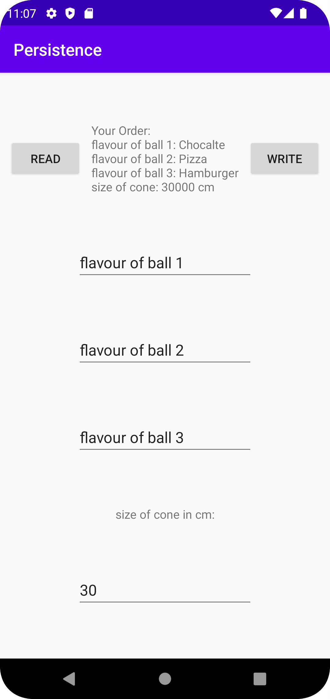

# Rapport

1. **UI Design:**
   In the initial setup, I configured the user interface to meet the project's specifications. I integrated a `TextView`, two `Button` views labeled 'Read' and 'Write', and four `EditText` views in the layout file. These were carefully placed to ensure both functionality and aesthetic appeal. The additional `EditText` captures the size of the ice cream cone, supplementing the original three intended for ice cream flavors.

   ```xml
   <!-- Example of EditText for ice cream size in the layout XML -->
   <EditText
       android:id="@+id/size"
       android:layout_width="match_parent"
       android:layout_height="wrap_content"
       android:hint="Enter size of the cone" />
   ```

2. **Button Functionality:**
   - The 'Write' button gathers inputs from the four `EditText` views and compiles these into a single row within a SQLite database, thus forming a comprehensive record of an ice cream order, including the three flavors and the size of the cone.
   
   ```java
   public void write(View view){
       String flavour1 = editText1.getText().toString();
       String flavour2 = editText2.getText().toString();
       String flavour3 = editText3.getText().toString();
       int size = Integer.parseInt(editText4.getText().toString());
       databaseTables.addIcecream(flavour1, flavour2, flavour3, size);
   }
   ```

   - The 'Read' button retrieves the order from the database and displays a formatted string in the `TextView`, providing a detailed summary of the last entered data.

   ```java
   public void read(View view) {
       List<DatabaseTables.Icecream> icecreams = databaseTables.getIcecreams();
       DatabaseTables.Icecream icecream = icecreams.get(0);
       String order = "Your Order:\nFlavour of ball 1: " + icecream.fob1 + "\nFlavour of ball 2: " + icecream.fob2 +
                      "\nFlavour of ball 3: " + icecream.fob3 + "\nSize of cone: " + icecream.size + " cm";
       textView.setText(order);
   }
   ```

3. **Database Adaptation:**
   - I adapted the SQLite table structure and queries to accommodate ice cream data, as opposed to mountain data used in the lecture examples. This involved creating a new table specifically designed to store ice cream details (`flavor of ball 1, 2, 3`, and `size`), and other changes.


   ```java
        static final String COLUMN_NAME_FOBONE = "fobone";
        static final String COLUMN_NAME_FOBTWO = "fobtwo";
        static final String COLUMN_NAME_FOBTHREE = "fobthree";
        static final String COLUMN_NAME_SIZE = "size";

   ```
   
   ```java
   // SQL to create an ice cream table instead of a mountain table
   static final String SQL_CREATE_ICECREAM_TABLE = 
       "CREATE TABLE " + Icecream.TABLE_NAME + " (" +
       Icecream.COLUMN_NAME_ID + " INTEGER PRIMARY KEY," +
       Icecream.COLUMN_NAME_FOBONE + " TEXT," +
       Icecream.COLUMN_NAME_FOBTWO + " TEXT," +
       Icecream.COLUMN_NAME_FOBTHREE + " TEXT," +
       Icecream.COLUMN_NAME_SIZE + " INT)";
   ```

   ```java
      etc.. 
   ```
Bilder läggs i samma mapp som markdown-filen.



Läs gärna:

- Boulos, M.N.K., Warren, J., Gong, J. & Yue, P. (2010) Web GIS in practice VIII: HTML5 and the canvas element for interactive online mapping. International journal of health geographics 9, 14. Shin, Y. &
- Wunsche, B.C. (2013) A smartphone-based golf simulation exercise game for supporting arthritis patients. 2013 28th International Conference of Image and Vision Computing New Zealand (IVCNZ), IEEE, pp. 459–464.
- Wohlin, C., Runeson, P., Höst, M., Ohlsson, M.C., Regnell, B., Wesslén, A. (2012) Experimentation in Software Engineering, Berlin, Heidelberg: Springer Berlin Heidelberg.
